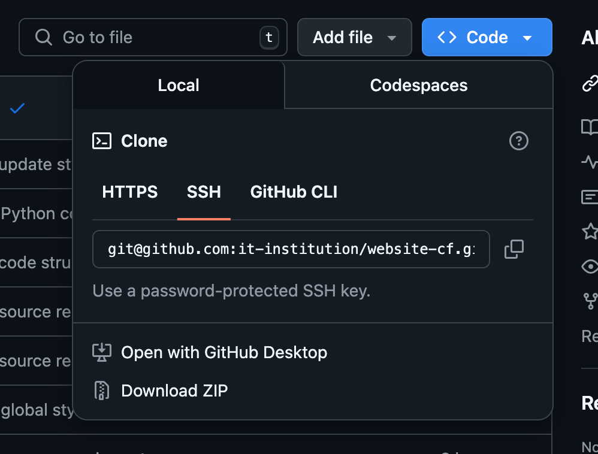
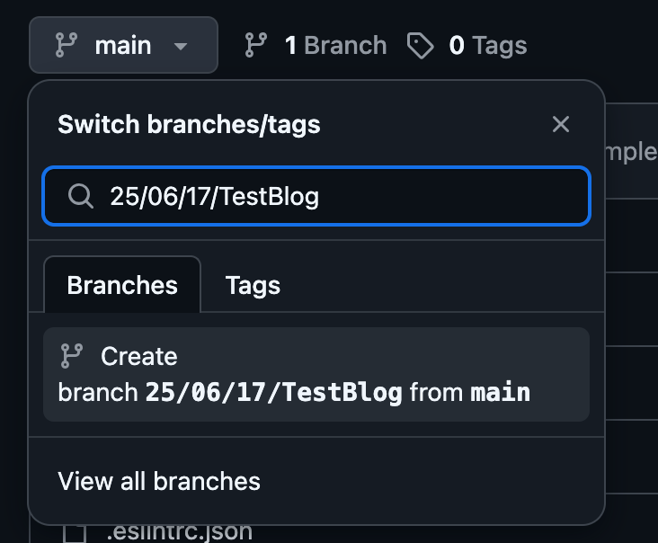
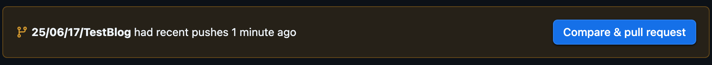
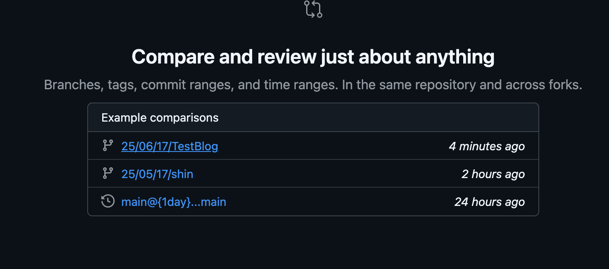
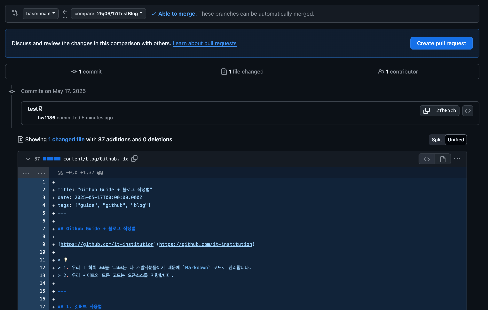
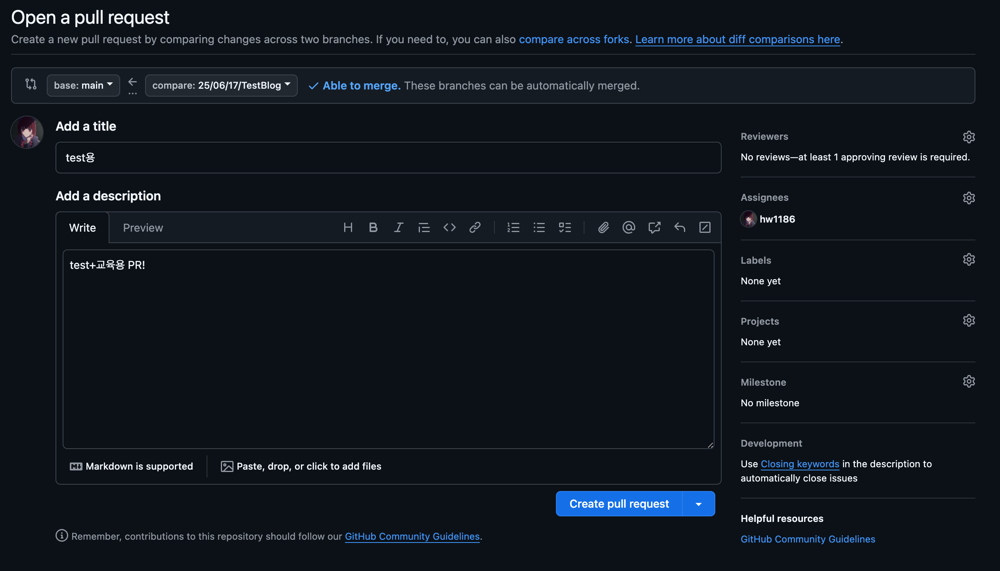
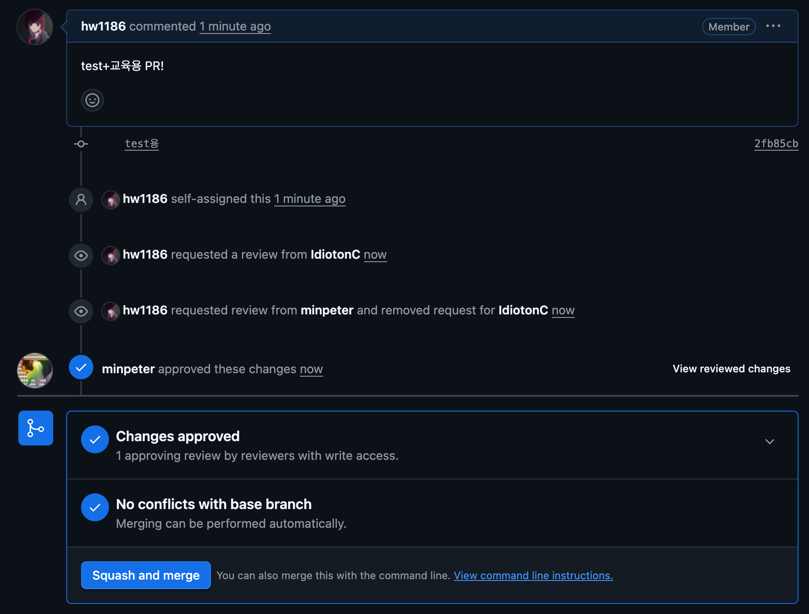
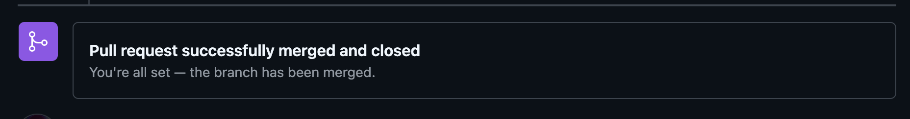
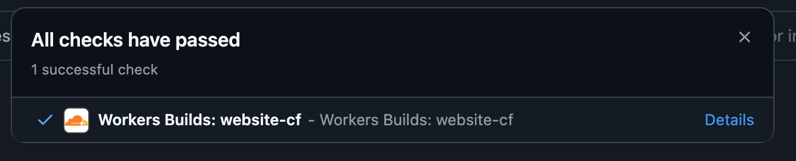
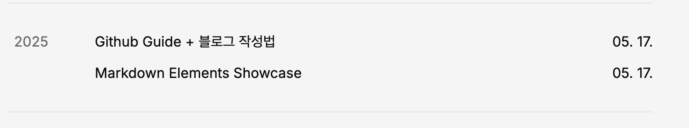

https://github.com/it-institution

<aside>
  1. 우리 IT학회 **블로그**는 다 개발자분들이기 때문에 `Markdown` 코드로
  관리합니다. 2. 우리 사이트와 모든 코드는 오픈소스를 지향합니다.
</aside>

### 1. 깃허브 사용법

**아시는분은 2번으로 바로 넘어가주세요.**

모르시는분들을 위해 먼저 깃허브 사용법을 알려 드리겠습니다. @신유찬

**Write 권한 부여**

1. 대충 어드민인 사람에게 깃허브 ID나 메일 보내주세요. @이런우 @민웅기
2. 메일로 `Organizations` 초대를 수락해주세요 그래야지 `push`가 가능합니다.

---

---

**Github에서 코드 clone 하기**

[https://github.com/it-institution/website-cf](https://github.com/it-institution/website-cf)

1. 위 깃허브 사이트를 들어가줍니다.
2. `Clone` 방법 중 `Https` `Ssh` 편하신걸 선택해주세요.



<aside>
SSH, HTTPS push할 시 인증 방법이 다릅니다.

(구글링하면 많이 나와요)

</aside>

1. clone받기

```bash
git clone git@github.com:it-institution/website-cf.git
```

### 2.0 블로그를 작성하기 전 절차

```bash
1. 블로그를 만들기전에 브랜치를 만들어줍니다.
2. 작성하신 브랜치로 블로그를 만들고 main에 Pull request를 해줍니다.
3. 본인이 PR날리고 머지 해줍니다.
3.1 PR날리기전에 확인 받고 싶으시면 다른분에게 리뷰 부탁해주시면 됩니다.
```

1. 브랜치를 먼저 만들어줍니다.

브랜치 이름은 **`[YYMMDD]/[BlogTitle]`** 입니다. ex) **`25/06/17/GithubGuide`**

1. 브랜치 만드는법



**`main`** **`Branch`**에서 이름 규칙대로 **`Branch`**를 만들어줍니다.

1. main에서 작성한 브랜치로 옮기는 방법

```bash
[main] git pull # 최신사항으로 업데이트
[main] git remote update # 브랜치 업데이트
[main] git checkout [작성한 브랜치] # 브랜치 옮기기

# 위 절차대로 진행하면
➜  website-cf git:(main) git checkout 25/06/17/TestBlog
branch '25/06/17/TestBlog' set up to track 'origin/25/06/17/TestBlog'.
새로 만든 '25/06/17/TestBlog' 브랜치로 전환합니다
➜  website-cf git:(25/06/17/TestBlog)

# 이렇게 됩니당
```

1. 이제 블로그 작성 진행해주시면 됩니다.

### 2.1 블로그작성법

먼저 우리 블로그는 `Markdown`으로 작성됩니다.

1. 블로그 디렉토리는 `website-cf/content/blog` 입니다.
2. test.mdx 파일은 블로그양식입니다 참고해주세요.
   1. **파일 제목은 경로가 됩니다.**
3. 블로그 작성하신 후 git push 해주세요

### 3. 블로그 올리는법 (Wirth Pull request)

```bash
git add [생성한 블로그 파일 이름]
git commit -m "하고싶은 말"
git push
```

- 정상적으로 진행한 결과

  ```bash
  # 정상적으로 진행한 결과
  ➜  blog git:(25/06/17/TestBlog) ✗ git add Github.mdx
  ➜  blog git:(25/06/17/TestBlog) ✗ git commit -m "test용"
  [25/06/17/TestBlog 2fb85cb] test용
   1 file changed, 37 insertions(+)
   create mode 100644 content/blog/Github.mdx
  ➜  blog git:(25/06/17/TestBlog) git status
  현재 브랜치 25/06/17/TestBlog
  브랜치가 'origin/25/06/17/TestBlog'보다 1개 커밋만큼 앞에 있습니다.
    (로컬에 있는 커밋을 제출하려면 "git push"를 사용하십시오)

  커밋할 사항 없음, 작업 폴더 깨끗함
  ➜  blog git:(25/06/17/TestBlog) git push
  오브젝트 나열하는 중: 8, 완료.
  오브젝트 개수 세는 중: 100% (8/8), 완료.
  Delta compression using up to 4 threads
  오브젝트 압축하는 중: 100% (4/4), 완료.
  오브젝트 쓰는 중: 100% (5/5), 1.01 KiB | 1.01 MiB/s, 완료.
  Total 5 (delta 1), reused 0 (delta 0), pack-reused 0
  remote: Resolving deltas: 100% (1/1), completed with 1 local object.
  remote:
  remote: GitHub found 1 vulnerability on it-institution/website-cf's default branch (1 moderate). To find out more, visit:
  remote:      https://github.com/it-institution/website-cf/security/dependabot/1
  remote:
  To github.com:it-institution/website-cf.git
     baf0021..2fb85cb  25/06/17/TestBlog -> 25/06/17/TestBlog
  ➜  blog git:(25/06/17/TestBlog)
  ```

**`push`**가 완료 됐다면 **`main`** 브랜치에 **`PR`**을 날려야 합니다.

1. push가 성공적으로 진행되었다면 github 페이지에 이렇게 나옵니다.

**이거하면 편하게 거의 다 됨**



1. 아니면 Pull Reques페이지에서 만들 수도 있습니다.
   1. New Pull Request 버튼을 눌러 줍니다.
   2. 자신이 만든 브랜치를 선택해줍니다.



1. Main을 대상으로 Pull Request를 적용해줍니다.
   1. base: main ← compare:작성한 브랜치
   2. Create Pull Request!



1. PR 생성 최종

사이드바 관련

- **Reviewers** : 리뷰할 사람이 필요하다면
- **Assignees** : \*\*\*\*작성자
- 나머지 : 추 후 추가될지도? 몰?루



1. 최종 **`merge`** 후 **`push`**

저는 민웅기씨를 **Reviewers**로 정하고 인증까지 받았습니다.



마지막으로 **`Squash and merge`**를 해줍니다.

1. 끝!



**업데이트 중인 사항은 github에서 확인가능**



**블로그에 바로 반영이됩니다.**



---

---

추가적인 문의가 있다면 @이런우 로 연락주세요.
